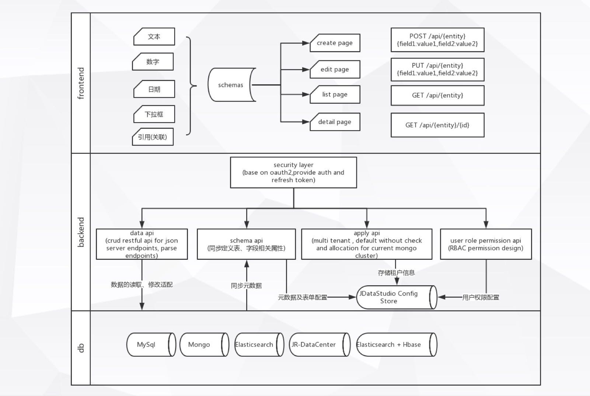

# jdatastudio
从数据库搭建restful api和中后台应用

[](jdatastudio.mp4)

## Features
* 即配即用：0编码，通过界面配置中后台系统
* 多数据源支持： 支持的数据源包括 mysql、mongo、elasticsearch、jr-datacenter、elasticsearch+hbase
* 多租户：数据源、权限设置物理隔离
* 组件化：文本、数字、日期、选择、引用(关联)
* Api Open : 后端所有数据访问接口、元数据接口、安全接口遵循RESTFUL协议
* 数据安全：https + spring security + jjwt + app saltKey + rbac
* 轻量：仅依赖 jdatastudio-admin.jar 和 mongodb，可独立部署
* 可扩展：支持数据脱敏、多表关联、数据过滤、自定义按钮

## Guide
```sh
java -jar jdatastudio-admin.jar --spring.data.mongodb.uri=mongodb://localhost:27017/jdatastudio-admin
```

## Examples
* `demo` https://www.jdatastudio.com admin admin
* `api` https://www.jdatastudio.com/swagger-ui.html

## 从数据源构建通用restful api

### apis
```
GET    /students
GET    /students/1
POST   /students
PUT    /students/1
```
### filter

```
GET /students?name=nick&grade=5
GET /students?id_in=1,2
```
### paginate

```
GET /students?_start=0&_end=10
```

### sort

```
GET /students?_order=ASC&_sort=score
```

### operators

```
eq      等于 name=nick
gte     大于等于 grade_gte=5
gt      大于 grade_gt=5
lte     小于等于 grade_lte=5
lt      小于 grade_lt=5
like    小于 name_like=ni
in      存在于 name_in=nick,paul
```

## 配置schema，生成前端页面

### 数据源(超级管理员维护)
```
dbType    数据源类型(mysql,mongodb,elasticsearch)
url       数据源连接 jdbc:mysql://172.19.152.132:3306/student
username  用户名 root
password  密码 ******
```
### 表
```
name    表名
label   标签
```
### 字段
```
name                字段名
label               字段标签
component           组件类型
mainField           是否主字段 /students?q=nick 将按此字段检索
partOfPrimaryKey    是否联合主键，表中包含多个主键时，将按__分隔符拼接id的值
sensitiveType       脱敏类型

showInList          是否展示在列表页
sortable            是否支持排序
showInShow          是否展示在详情页

showInFilter        是否以此字段过滤
alwaysOn            前端是否总展示
multiFilter         是否支持多选过滤

showInEdit          是否展示在编辑页
showInCreate        是否展示在新建页
maxLength           最大长度(校验)
required            是否必填
defaultValue        默认值
dbColumnType        数据库字段类型(varchar,int...)
```

#### 组件类型

```
Text	    文本
Number	    数字
Select	    选择
Reference   引用
Date	    日期
```
#### 脱敏类型

```
nonsensitive    非敏感数据
sensitive       其他敏感数据
mobile          手机
card            银行卡号
id              身份证号
```